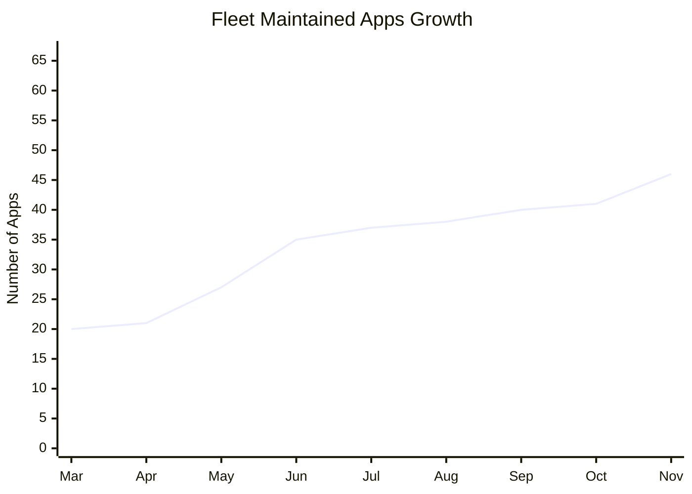

# Fleet Maintained Apps Growth Tracker

A standalone repository that tracks and visualizes the growth of Fleet-maintained applications over time. This project automatically pulls data from the [fleetdm/fleet](https://github.com/fleetdm/fleet) repository and generates interactive visualizations.

## 📊 Current Stats

| Metric | Value |
|--------|-------|
| **Total Apps** | 57 |
| **Apps Added Since Launch** | 37 |
| **Days Tracked** | 256 |
| **Average Growth Rate** | 4.4 apps/month |
| **Growth Events** | 11 |
| **Date Range** | 2025-03-04 to 2025-11-15 |

## 📈 Growth Chart

### Cumulative Growth Over Time



### Growth Timeline (ASCII Chart)

```
Mar 4, 2025     │█████████████████  20 apps (+20)
Mar 12, 2025    │██████████████████  21 apps (+ 1)
Mar 21, 2025    │███████████████████████  27 apps (+ 6)
Mar 27, 2025    │██████████████████████████████  35 apps (+ 8)
Mar 28, 2025    │████████████████████████████████  37 apps (+ 2)
Oct 24, 2025    │█████████████████████████████████  38 apps (+ 1)
Nov 7, 2025     │███████████████████████████████████  40 apps (+ 2)
Nov 8, 2025     │███████████████████████████████████  41 apps (+ 1)
Nov 12, 2025    │████████████████████████████████████████  46 apps (+ 5)
Nov 14, 2025    │██████████████████████████████████████████  48 apps (+ 2)
Nov 15, 2025    │██████████████████████████████████████████████████  57 apps (+ 9)
```

### Recent Growth Milestones

| Date | Apps Added | Total Apps |
|------|------------|------------|
| Nov 15, 2025 | +9 | 57 |
| Nov 14, 2025 | +2 | 48 |
| Nov 12, 2025 | +5 | 46 |
| Nov 8, 2025 | +1 | 41 |
| Nov 7, 2025 | +2 | 40 |
| Oct 24, 2025 | +1 | 38 |
| Mar 28, 2025 | +2 | 37 |
| Mar 27, 2025 | +8 | 35 |
| Mar 21, 2025 | +6 | 27 |
| Mar 12, 2025 | +1 | 21 |

## ✨ Features

- 📊 **Interactive Charts**: View cumulative growth and additions per event
- 📅 **Continuous Daily Tracking**: Not just commit days, but every day
- 🔄 **Automatic Updates**: Daily updates at 12:00 PM UTC via GitHub Actions
- 📈 **Historical Data**: Complete visualization across the entire year
- 📱 **Responsive Design**: Works on desktop and mobile

## 🔧 How It Works

1. **Data Collection**: A Go script uses the GitHub API to fetch commit history and file content for `ee/maintained-apps/outputs/apps.json` without cloning the repository
2. **Data Processing**: The script generates a continuous daily CSV file with app counts
3. **Visualization**: An HTML file with embedded Chart.js creates interactive charts
4. **Automation**: GitHub Actions runs daily at 12:00 PM UTC to update the data

## 🌐 View Live

👉 **[View Interactive Dashboard](https://fleetdm.github.io/fleet-apps-growth-tracker/)**

## 📁 Files

- `main.go` - Fetches data from fleetdm/fleet and generates CSV
- `generate_html.go` - Generates interactive HTML visualization
- `generate_readme.go` - Generates this README with embedded charts
- `data/apps_growth.csv` - Generated CSV data file
- `.github/workflows/update-data.yml` - GitHub Actions workflow for daily updates

## 💻 Local Development

### Prerequisites

- Go 1.21+

### Setup

```bash
# Clone repository
git clone <your-repo-url>
cd fleet-apps-growth-tracker

# Generate data
go run main.go

# Generate HTML
go run generate_html.go

# Generate README
go run generate_readme.go

# Open index.html in your browser
open index.html
```

## 📚 Data Source

This project pulls data from:
- **Repository**: [fleetdm/fleet](https://github.com/fleetdm/fleet)
- **File**: `ee/maintained-apps/outputs/apps.json`
- **Method**: GitHub API (no repository cloning required)

## 📄 License

MIT License - feel free to use this project for tracking other repositories!
